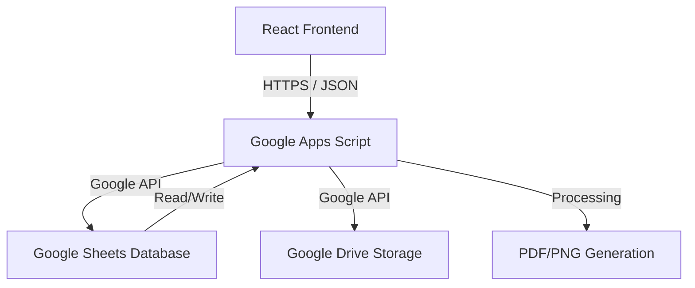

# System Architecture

This document describes the current architecture of the **Inventory Management System (demo-inventory-app)**.

## Overview

The system followed a transition from a local-heavy automation (Excel/Python/C) to a cloud-integrated Web application. The current production environment uses a **React Frontend** and a **Google Apps Script (GAS) Backend**.

## Components

### 1. Frontend (React)
- **Framework**: React 18+ with Vite/CRA.
- **State Management**: `zustand` for authentication and data caching.
- **Key Pages**:
    - `LoginPage`: Google OAuth integration.
    - `MainPage`: Real-time inventory view, application forms, and history tracking.
- **Services**: `services/api.js` handles all communication with the GAS Web App URL.

### 2. Backend (Google Apps Script)
- **API Endpoint**: Hosted as a Google Apps Script Web App.
- **Functions**:
    - `getEquipmentData`: Fetches real-time stock from Google Sheets.
    - `uploadFile`: Saves files directly to designated Google Drive folders.
    - `updateFormSubmission`: Updates the spreadsheet when a demo form is submitted.
    - `returnEquipment`: Manages the rental-to-stock transition logic.

### 3. Database & Storage
- **Google Sheets**: Acts as the primary database for equipment, partners, and usage history.
- **Google Drive**: Stores generated PDFs and uploaded demo application images.

## Data Flow (Demo Application)
1. User selects items in the React app.
2. Form data is sent to GAS.
3. GAS populates a template Spreadsheet.
4. GAS exports the sheet as PDF/PNG.
5. React displays the generated preview files from Google Drive.
